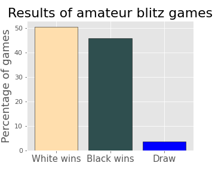
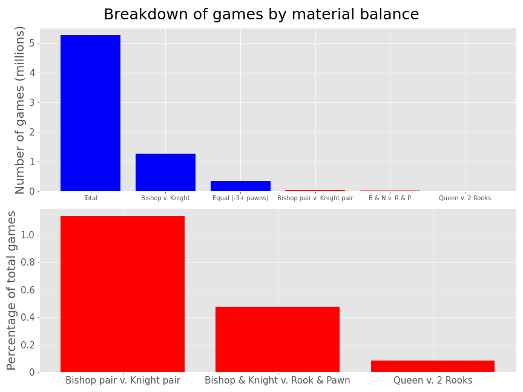

# Common Material Imbalances in Chess: an examination via online amateur blitz games

_________________________

## Table of Contents
_________________________

1. [Background](#background)
2. [Data](#data)
    * [Raw Dataset](#raw-dataset)
    * [Refining the Dataset](#refining-the-dataset)
3. [Exploratory Data Analysis](#exploratory-data-analysis)
4. [Hypothesis Testing](#hypothesis-testing)
    * [Digging Deeper](#digging-deeper)
5. [Sources](#sources)

<div align="center">
    
</div>

## Background
Chess is a two-person strategy game where each player attempts to coordinate their pieces -- pawns, knights, bishops, rooks, queen, and king -- to attack the opposing king and prevent its escape, resulting in checkmate and the end of the game. A win for White is recorded as 1-0, denoting 1 point for White and 0 points for Black. Similarly, a win for Black is 0-1, and a draw is 0.5-0.5. I will use the term <strong>point value</strong> to refer to the overall result of the game. Each of the pieces has a relative material value, commonly given as:

| Piece  | Value |
|  :-:   | :-: |
| Pawn   | 1 |
| Knight (N) | 3 |
| Bishop (B) | 3 |
| Rook (R)   | 5 |
| Queen (Q)  | 9 |

Based on this table, there are material exchanges that are nominally equal but that create an imbalance in the game: bishop for knight, 2 bishops for 2 knights, bishop and knight for rook and pawn, and queen for two rooks, for example. Chess masters, teachers, and coaches generally prefer one side of these exchanges over the other despite the seemingly equal trade. For example, masters <strong>strongly</strong> prefer to have a pair of bishops over a pair of knights, a knight and bishop over a rook and pawn, and 2 rooks over a queen. That being said, any chess player will tell you that the size of the advantage depends on the position.

My goal is to answer the following questions:
1. Does the material imbalance confer an advantage, even to amateur players?
2. Can we isolate the characteristics that make one side of the imbalance favorable?

## Data

### Raw Dataset

The online free chess website [lichess.org](http://www.lichess.org/) features a database of every game ever played from January 2013 to May 2021. The data is in Portable Game Notation (PGN) format, as shown in the game below, in which two amateur players reach a bishop pair vs. knight pair position that White converted into a victory by resignation.

```text
[Event "Rated Blitz game"]
[Site "https://lichess.org/yfq9u4fm"]
[Date "????.??.??"]
[Round "?"]
[White "tiggran"]
[Black "treehugger"]
[Result "1-0"]
[WhiteElo "1599"]
[BlackElo "1487"]
[ECO "B00"]
[Opening "Owen Defense"]
[TimeControl "300+0"]
[UTCDate "2013.01.01"]
[UTCTime "04:13:22"]
[Termination "Normal"]
[WhiteRatingDiff "+8"]
[BlackRatingDiff "-8"]

1. e4 b6 2. Nf3 Bb7 3. Nc3 e6 4. d3 Bb4 5. Bd2 Bxc3 6. Bxc3 Ne7 7. Be2 f6
8. e5 Ng6 9. exf6 gxf6 10. Qd2 Bxf3 11. Bxf3 c6 12. O-O-O Qe7 13. Rhe1 e5
14. Bd4 c5 15. Bc3 Nc6 16. Bxc6 dxc6 17. Qh6 Rg8 18. g3 Qg7 19. Qh3 Ke7 20.
d4 Rad8 21. dxe5 Rxd1+ 22. Rxd1 fxe5 23. Rd7+ 1-0
```

The unabridged raw dataset of over 2.2 billion games is available at [database.lichess.org](https://database.lichess.org/). Each month's games are available to download as bzip2 files. Of these, about 15 million were played in 2013 or 2014.

### Refining the Dataset

In blitz chess, there is an added component of a clock that can cause a player to lose if they run out of time. This often results in a player making ill-considered and suboptimal moves. Blitz is also the preferred method of many players online, so for the sake of consistency and applicability I limited my dataset to blitz games (3 - 5 minutes per player) of amateur players (lichess.org rating between 1200 and 2000), played in 2013 or 2014. My dataset is the 5,261,428 games that fit this criteria. In order to process the large data volume, I used the open source command line tool [pgn-extract](https://www.cs.kent.ac.uk/people/staff/djb/pgn-extract/) to match on time control and player blitz rating.

_________________________

## Exploratory Data Analysis
The first thing I looked at was win rate for White and Black vs. draw rate:

<div align="center">
    
</div>

We see that the games are usually decisive; rarely drawn. There is also evidence of White's first move advantage showing in a win rate 5% higher than Black's. From here, I was curious to see how many games featured completely equal material balance <strong>after the opening</strong>, which I defined as each side having lost at least 3 points of material and the position being stable to a depth of 3 moves.

<div align="center">
    
</div>

A shockingly large number of amateur blitz games feature one side winning a pawn or more out of the opening, about 2 in 3 games. Some of this could be from <strong>gambits</strong> -- sacrificing a pawn for the ability to quickly bring pieces into play -- but these too can equalize after the gambiteer converts their positional advantage into winning back the pawn.

_________________________

## Hypothesis Testing
At this point, the games featuring the interesting material imbalances have been isolated and it seems reasonable to ask: is there any advantage for the amateur player to have two bishops over two knights, a knight and bishop over a rook and pawn, or two rooks over a queen?

The metric I chose to answer this question is the average point value:

$$\text{Average point value} = \text{Win rate} + \frac{\text{Draw rate}}{2}$$

This can be shown to be equivalent to using the difference between win rate and loss rate:

$$\text{Loss rate} = 1 - \text{Win rate} - \text{Draw rate}$$
$$\text{Average point value} = \text{Win rate} + \frac{1 - \text{Win rate} - \text{Loss rate}}{2}$$
$$ = \frac{1}{2} + \frac{\text{Win rate} - \text{Loss rate}}{2}$$

Because average point value is the weighted mean of proportions that sum to 1, it also behaves as a proportion and allows us to perform a simple 1-sample test of proportions. The null hypothesis in each case is that the average point value is 0.5 (win rate = loss rate), and the alternative hypothesis is that the average point value is not 0.5, giving us a two-tailed test. Our alpha value -- p-value threshold for rejecting the null hypothesis -- is 5%, and after applying the Bonferroni correction to the 3 simultaneous tests we have an effective rejection threshold of 1.66667%. 

$$H_\text{o}: p = 0.5$$
$$H_\text{a}: p \neq 0.5$$

<center>
Sample 1 (Bishop pair v. Knight pair):
<br>

| Statistic          	| Value     	|
|--------------------	|-----------	|
| Average Point Value   | 0.551400  	|
| Sample Size        	| 59,698 	    |
| Standard Error    	| 0.002036  	|
| Z-statistic        	| 25.25127  	|
| p value               | 0             |

<br>
<br>

Sample 2 (Knight & Bishop v. Rook & Pawn):
<br>

| Statistic          	| Value     	|
|--------------------	|-----------	|
| Average Point Value   | 0.553601  	|
| Sample Size        	| 24,953 	    |
| Standard Error    	| 0.003147  	|
| Z-statistic        	| 17.03226  	|
| p value               | 0             |

<br>
<br>

Sample 3 (Two Rooks v. Queen):
<br>

| Statistic          	| Value     	|
|--------------------	|-----------	|
| Average Point Value   | 0.508331  	|
| Sample Size        	| 4,441 	    |
| Standard Error    	| 0.007502  	|
| Z-statistic        	| 1.110585  	|
| p value               | 0.266747      |

</center>

While each of these cases had an effect direction that corresponded to masters' preferences, only the Bishop pair v. Knight pair and Knight & Bishop v. Rook & Pawn had a statistically significant effect. We choose to reject the null hypothesis for these first two cases, but fail to reject the null hypothesis for the final case of Two Rooks v. Queen.
_________________________

### Digging Deeper

