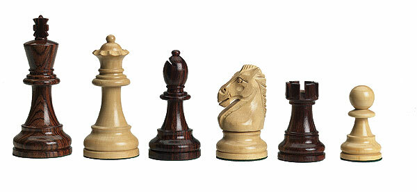

# Common Material Imbalances in Chess: an examination via online amateur blitz games

_________________________

## Table of Contents
_________________________

1. [Background](#background)
2. [Data](#data)
3. [Exploratory Data Analysis](#exploratory-data-analysis)
4. [Hypothesis Testing](#hypothesis-testing)
5. [Sources](#sources)

    

## Background
Chess is a two-person strategy game where each player attempts to coordinate their pieces -- pawns, knights, bishops, rooks, queen, and king -- to attack the opposing king and prevent its escape, resulting in checkmate and the end of the game. Each of these pieces has a relative material value, commonly given as:

| Piece  | Value |
|  :-:   | :-: |
| Pawn   | 1 |
| Knight | 3 |
| Bishop | 3 |
| Rook   | 5 |
| Queen  | 9 |

In blitz chess, there is an added component of a clock that can cause a player to lose if they run out of time.

## Data
_________________________

## Exploratory Data Analysis

_________________________
